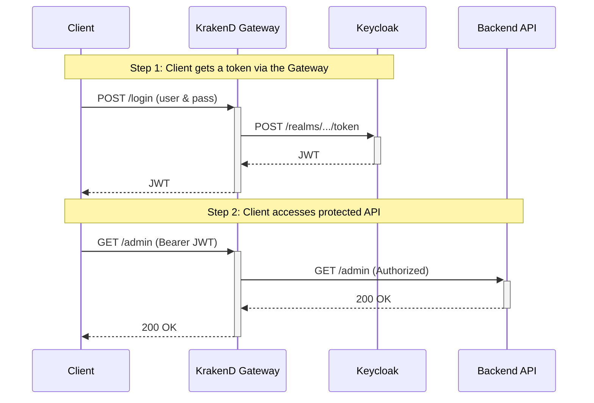

# Secure Go RBAC Backend API with KrakenD and Keycloak

This project demonstrates a complete, production-ready setup for securing a Backend API using **KrakenD** as an API Gateway and **Keycloak** for identity and access management. It also implements **fine-grained Role-Based Access Control (RBAC)** backed by MongoDB.

All traffic—including token requests—is routed through KrakenD. The gateway validates JWTs and applies routing rules before forwarding requests to the backend.

---

## 🧱 Architecture

In this secure architecture, the **only** entry point for external traffic is the KrakenD Gateway. All internal services are isolated inside the Docker network.

```
+--------+            +-------------------+      +-----------------+
| Client |----------->|                   |----->| Keycloak        |
|        |            |   KrakenD Gateway |<-----| (for /login &   |
|        |            |   (Port :8081)    |      |  JWKS)          |
|        |<---------- |                   |
+--------+            |  - JWT Validation |      +-----------------+
                      |  - Routing        |----->|  Backend API    |
                      |  - Proxy /login   |<-----|  (Port :3000)   |
                      |                   |      +-----------------+
                      +-------------------+
```

---

Here's the **adjusted and clarified version** of your RBAC section to avoid redundancy, cleanly present the **multi-permission example**, and align better with the rest of your documentation:

---

## 🔐 RBAC: Role-Based Access Control

RBAC is enforced by the backend using JWT claims and role-permission mappings stored in **MongoDB**. Each role can contain multiple permissions, which define what the user can access based on **path**, **region**, and **country-level** rules.

### Example Role Document (`roles` collection in MongoDB)

```json
{
  "role_id": "user",
  "permissions": [
    {
      "path": "hr:payroll:view",
      "regions": ["SEA"],
      "except_countries": ["MM"]
    },
    {
      "path": "hr:benefits:view",
      "regions": ["SEA"],
      "except_regions": ["VN"]
    },
    {
      "path": "profile:info:read",
      "countries": ["TH", "SG"]
    }
  ]
}
```

> 🔍 This example grants the `user` role:
>
> * Access to **payroll view** in Southeast Asia, except Myanmar.
> * Access to **benefits view** in Southeast Asia, except Vietnam.
> * Access to **profile info read** only for users from Thailand and Singapore.

---

### 🧾 Access Evaluation Logic

* **Paths** follow the format `domain:resource:action` (e.g., `hr:payroll:view`).
* Wildcards `*` are supported in any segment:
  e.g., `admin:*:*`, `*:payroll:view`, or `*:*:*`.
* Each permission may include:

  * `regions`: allowed region codes (`SEA`, `GLOBAL`, etc.)
  * `countries`: specific allowed countries
  * `except_regions` and `except_countries`: explicit deny lists
  * `except_paths`: override to block certain paths even if matched

---

### 🧠 How It Works (Backend Logic)

1. **JWT is passed from KrakenD** to the backend.
2. Backend **parses the token** using `ParseUnverified` (no revalidation).
3. Backend **fetches roles from MongoDB** for the current user.
4. Backend checks:

   * Is the requested `path` permitted for any role?
   * Is the `country` allowed via `regions` or `countries`?
   * Are there any exclusion rules (e.g., `except_paths`)?

Only if all checks pass, the request is allowed.

---


## 🚦 Request Flow



---

## 📁 Project Structure

```
.
├── docker-compose.yml         # Services: MongoDB, Keycloak, Backend, Gateway
├── Dockerfile                 # Backend API
├── Dockerfile.keycloak        # Custom Keycloak image
├── krakend.json               # KrakenD declarative config
├── main.go                    # Go backend w/ JWT & MongoDB RBAC
├── mongo-init.js              # MongoDB seed data (roles, items)
├── test-all.ps1               # PowerShell test script
├── test-all.sh                # Bash test script
└── keycloak/
    └── import-realm.json      # Realm setup with users and client
```

---

## ✅ Prerequisites

* [Docker](https://www.docker.com/)
* [Docker Compose](https://docs.docker.com/compose/)
* Windows users: PowerShell 7+, and set execution policy:

```powershell
Set-ExecutionPolicy RemoteSigned -Scope CurrentUser
```

---

## 🚀 How to Run

```bash
# 1. Clean up volumes (reset Keycloak, MongoDB)
docker-compose down -v

# 2. Build & start all services
docker-compose up --build -d

# 3. Wait ~60s for all to initialize
docker-compose ps

# 4. Verify gateway works
curl http://localhost:8081/public
# → {"message":"This is a public endpoint."}
```

---

## 👥 Available Users

| Username | Password      | Roles   |
| -------- | ------------- | ------- |
| `alice`  | `password123` | `user`  |
| `bob`    | `password123` | `admin` |

---

Here's the **Manual Testing** section updated for **both Windows (PowerShell)** and **Linux/macOS (bash)** environments:

---

## 🧪 Testing the System

### 🖥️ Manual Testing

#### 🔸 For **Linux/macOS (bash)**

```bash
# Get JWT for 'alice'
TOKEN=$(curl -s -X POST http://localhost:8081/login \
  -H "Content-Type: application/x-www-form-urlencoded" \
  -d "grant_type=password&client_id=fiber-app&username=alice&password=password123" | jq -r .access_token)

# Call protected endpoints
curl -H "Authorization: Bearer $TOKEN" http://localhost:8081/profile
curl -H "Authorization: Bearer $TOKEN" http://localhost:8081/user
curl -H "Authorization: Bearer $TOKEN" http://localhost:8081/admin
```

> 💡 You need `jq` installed for this script to extract the token.

---

#### 🔸 For **Windows (PowerShell)**

```powershell
# Get JWT for 'alice'
$response = Invoke-RestMethod -Method Post `
  -Uri http://localhost:8081/login `
  -ContentType "application/x-www-form-urlencoded" `
  -Body @{ grant_type='password'; client_id='fiber-app'; username='alice'; password='password123' }

$token = $response.access_token

# Call protected endpoints
Invoke-RestMethod -Headers @{ Authorization = "Bearer $token" } -Uri http://localhost:8081/profile
Invoke-RestMethod -Headers @{ Authorization = "Bearer $token" } -Uri http://localhost:8081/user
Invoke-RestMethod -Headers @{ Authorization = "Bearer $token" } -Uri http://localhost:8081/admin
```

> ✅ Works with PowerShell 7+. If you're using Windows Terminal or VSCode terminal, you're ready to go.

---

### Automated

Run full script for Alice and Bob:

```bash
./test-all.sh    # or .\test-all.ps1 on Windows
```

---

## 🧠 Tips for Extending RBAC

* Add more roles to MongoDB using `mongo-init.js` or `mongosh`:

  ```js
  db.roles.insertOne({
    role_id: "manager",
    permissions: [
      { path: "report:monthly:view", regions: ["SEA"], countries: ["TH"] }
    ]
  })
  ```

* Add endpoints to `main.go` with `requirePermission(...)` middleware.

* Use `curl localhost:8081/__debug/` if enabled for live inspection.

---

