# Secure Go RBAC Backend API with KrakenD and Keycloak

This project demonstrates a complete, production-ready setup for securing a Backend API using **KrakenD** as an API Gateway and **Keycloak** for identity and access management. It also implements **fine-grained Role-Based Access Control (RBAC)** backed by MongoDB.

All traffic—including token requests—is routed through KrakenD. The gateway validates JWTs and applies routing rules before forwarding requests to the backend.

---

## 🧱 Architecture

In this secure architecture, the **only** entry point for external traffic is the KrakenD Gateway. All internal services are isolated inside the Docker network.

```
+--------+           +-------------------+      +-----------------+
| Client |---------->|                   |----->| Keycloak        |
|        |           |  KrakenD Gateway  |<-----| (for /login &   |
|        |           |  (Port :8081)     |      |  JWKS)          |
|        |<----------|                   |      +-----------------+
+--------+           |  - JWT Validation |      +-----------------+
                     |  - Routing        |----->|  Backend API    |
                     |  - Proxy /login   |<-----|  (Port :3000)   |
                     |                   |      +-----------------+
                     +-------------------+
```

---

## 🚦 End-to-End Request Flow

The entire process, from authentication to accessing a protected resource, involves two main steps.


---

## 🔐 RBAC: Role-Based Access Control In-Depth

RBAC is enforced by the Go backend using JWT claims and role-permission mappings stored in **MongoDB**. This allows for a dynamic and powerful access control system.

### Example Role Document (`roles` collection in MongoDB)

Each role can contain multiple permissions, which define what the user can access based on **path**, **region**, and **country-level** rules.

```json
{
  "role_id": "user",
  "permissions": [
    {
      "path": "hr:payroll:view",
      "regions": ["SEA"],
      "except_countries": ["MM"]
    },
    {
      "path": "hr:benefits:view",
      "regions": ["SEA"],
      "except_regions": ["VN"]
    },
    {
      "path": "profile:info:read",
      "countries": ["TH", "SG"]
    }
  ]
}
```

> 🔍 This example grants the `user` role:
>
> * Access to **payroll view** in Southeast Asia, except Myanmar.
> * Access to **benefits view** in Southeast Asia, except Vietnam.
> * Access to **profile info read** only for users from Thailand and Singapore.

### Access Evaluation Logic

* **Paths** follow the format `domain:resource:action` (e.g., `hr:payroll:view`).
* Wildcards `*` are supported in any segment: e.g., `admin:*:*`, `*:payroll:view`, or `*:*:*`.
* Each permission may include:
    * `regions`: allowed region codes (`SEA`, `GLOBAL`, etc.)
    * `countries`: specific allowed countries
    * `except_regions` and `except_countries`: explicit deny lists
    * `except_paths`: override to block certain paths even if matched

---

## 🔄 What Happens When a JWT Request Comes In?

This section details the **internal logic** of the Go backend whenever it receives a request with a JWT token from KrakenD.

### Step-by-Step Breakdown

#### ✅ 1. Client sends request with JWT
The request includes an `Authorization` header to a protected endpoint.
```
Authorization: Bearer <JWT>
GET /user/payroll/view
```

#### 🧰 2. Middleware `requirePermission(...)` is triggered
This middleware wraps the protected route and is configured with the specific permission required for that endpoint.
```go
Requirement{
  Path: "hr:payroll:view",
  Country: "TH",
}
```

#### 🔓 3. JWT is parsed (no revalidation)
* **Function:** `parseToken(c *fiber.Ctx)`
* The backend extracts claims (like `preferred_username`, `roles`, `sub`).
* The JWT signature is **not** revalidated here because it is already trusted, having been validated by the KrakenD Gateway.
* **Example Claims:**
    ```json
    {
      "preferred_username": "alice",
      "roles": ["user"],
      "sub": "abc123"
    }
    ```

#### 👤 4. Roles are resolved from MongoDB
* **Function:** `extractUser(claims)`
* The backend uses the `roles` array from the JWT claims to query the `roles` collection in MongoDB.
* It fetches all permission rules associated with the user's roles.

#### 🔐 5. Access is evaluated against path + region/country rules
* **Function:** `IsAllowed(user, req)`
* It checks:
    * ✅ If the requested path matches any permission.
    * ✅ If the region/country is allowed (directly or via region mapping).
    * ❌ If any exclusion (`except_paths`, `except_countries`, etc.) overrides and denies the request.

#### 🛑 6. Decision is made
* ✅ **If allowed** → The request proceeds to the final route handler.
* ❌ **If not allowed** → The server returns a `403 Forbidden` error with an explanation.

#### Example Responses

* **Success Response:**
    ```json
    {
      "message": "Authorized to view payroll in Thailand"
    }
    ```
* **Denied Response:**
    ```json
    {
      "error": "Access denied for: hr:payroll:view"
    }
    ```

> ℹ️ This layered RBAC model ensures **dynamic, MongoDB-driven, fine-grained access control** for each endpoint based on JWT identity and geography.


### Backend Logic Flowchart and Details

This provides a more granular view of the access evaluation logic.

```mermaid
flowchart TD
    A([Start]) --> B["JWT arrives from KrakenD<br/>Authorization: Bearer <token>"]
    B --> C["parseToken (unverified)"]
    C --> D["extractUser:<br/>• fetch roles from MongoDB<br/>• build User.Roles & AllowedCountries"]
    D --> E{Requirement.Country ∈ AllowedCountries?}
    E -- No --> F([403 Forbidden])
    E -- Yes --> G["Loop over each role.Permission"]
    G --> H{Any ExceptPaths<br/>match Requirement.Path?}
    H -- Yes --> F
    H -- No --> I{matchPath &<br/>isCountryPermitted?}
    I -- Yes --> J([Proceed to handler])
    I -- No --> G
    J --> K([End])
    F --> K
```



1.  **JWT arrives from KrakenD** in `Authorization: Bearer <token>`.
2.  **`parseToken`** does an unverified parse (`ParseUnverified`) to pull out the claims.
3.  **`extractUser`** looks up each role in MongoDB and builds:
    * A `User.Roles` slice of `Role{Permissions: [...]}`
    * A deduplicated `User.AllowedCountries` list by expanding every `Permission.Regions` (via a static `regionMap`) and honoring any `GLOBAL` wildcard.
4.  **`IsAllowed(user, Requirement)`** enforces:
    1.  **Country pre-check**: if `Requirement.Country` ∉ `user.AllowedCountries` → **deny**.
    2.  **For each** `role.Permissions`:
        * **❌ Exclusions**: if any `ExceptPaths` matches `Requirement.Path`, **deny** immediately.
        * **✅ Allow**: if `matchPath(perm.Path, Requirement.Path)` **and** `isCountryPermitted(Requirement.Country, perm)` (which itself checks included/excluded countries & regions), **allow**.
    3.  If no permission grants access, **deny**.
5.  If allowed, request proceeds; otherwise you get a `403 Forbidden`.

---

## ✅ Prerequisites

* [Docker](https://www.docker.com/)
* [Docker Compose](https://docs.docker.com/compose/)
* Windows users: PowerShell 7+, and set execution policy:
    ```powershell
    Set-ExecutionPolicy RemoteSigned -Scope CurrentUser
    ```

---

## 🚀 How to Run

1.  **Clean up previous volumes** (this will reset Keycloak and MongoDB data).
    ```bash
    docker-compose down -v
    ```
2.  **Build and start all services** in detached mode.
    ```bash
    docker-compose up --build -d
    ```
3.  **Wait ~60 seconds** for all services to initialize. You can check their status with:
    ```bash
    docker-compose ps
    ```
4.  **Verify the gateway is running** by accessing the public endpoint.
    ```bash
    curl http://localhost:8081/public
    # → {"message":"This is a public endpoint."}
    ```

---

## 🧪 Testing the System

### Available Users

| Username | Password      | Roles   |
| :------- | :------------ | :------ |
| `alice`  | `password123` | `user`  |
| `bob`    | `password123` | `admin` |

### Manual Testing

#### 🔸 For Linux/macOS (bash)

> 💡 You need `jq` installed for this script to extract the token.

```bash
# Get JWT for 'alice'
TOKEN=$(curl -s -X POST http://localhost:8081/login \
  -H "Content-Type: application/x-www-form-urlencoded" \
  -d "grant_type=password&client_id=fiber-app&username=alice&password=password123" | jq -r .access_token)

# Call protected endpoints
curl -H "Authorization: Bearer $TOKEN" http://localhost:8081/profile
curl -H "Authorization: Bearer $TOKEN" http://localhost:8081/user
curl -H "Authorization: Bearer $TOKEN" http://localhost:8081/admin
```

#### 🔸 For Windows (PowerShell)

> ✅ Works with PowerShell 7+. If you're using Windows Terminal or VSCode terminal, you're ready to go.

```powershell
# Get JWT for 'alice'
$response = Invoke-RestMethod -Method Post `
  -Uri http://localhost:8081/login `
  -ContentType "application/x-www-form-urlencoded" `
  -Body @{ grant_type='password'; client_id='fiber-app'; username='alice'; password='password123' }

$token = $response.access_token

# Call protected endpoints
Invoke-RestMethod -Headers @{ Authorization = "Bearer $token" } -Uri http://localhost:8081/profile
Invoke-RestMethod -Headers @{ Authorization = "Bearer $token" } -Uri http://localhost:8081/user
Invoke-RestMethod -Headers @{ Authorization = "Bearer $token" } -Uri http://localhost:8081/admin
```

### Automated Testing

Run the full test script which tests permissions for both Alice and Bob.

> 🧪 This script will:
>
> 1.  Acquire tokens via `/login` for each user.
> 2.  Test `/public`, `/profile`, `/user`, and `/admin` endpoints.
> 3.  Report ✅ success or ❌ failure for each check.

#### 🔸 Linux/macOS:
```bash
./test-all.sh
```

#### 🔸 Windows (PowerShell 7+):
```powershell
.\test-all.ps1
```

---

## 📁 Project Structure & Customization

### Project Files
```
.
├── docker-compose.yml        # Services: MongoDB, Keycloak, Backend, Gateway
├── Dockerfile                # Backend API
├── Dockerfile.keycloak       # Custom Keycloak image
├── krakend.json              # KrakenD declarative config
├── main.go                   # Go backend w/ JWT & MongoDB RBAC
├── mongo-init.js             # MongoDB seed data (roles, items)
├── test-all.ps1              # PowerShell test script
├── test-all.sh               # Bash test script
└── keycloak/
    └── import-realm.json     # Realm setup with users and client
```

### Tips for Extending RBAC

* **Add more roles** to MongoDB using `mongo-init.js` before startup, or live via `mongosh`:
    ```js
    db.roles.insertOne({
      role_id: "manager",
      permissions: [
        { path: "report:monthly:view", regions: ["SEA"], countries: ["TH"] }
      ]
    })
    ```
* **Add new endpoints** to `main.go` and protect them with the `requirePermission(...)` middleware.
* **Debug KrakenD** by using `curl localhost:8081/__debug/` (if the debug endpoint is enabled in `krakend.json`) for live inspection.